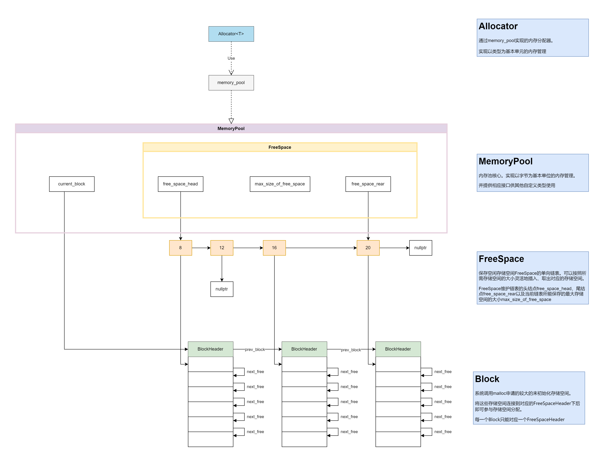

# 项目简介

本项目为基于c++ 实现的内存池项目，可以方便快捷地实现内存的分配与释放


内存池内部逻辑图如下：



内存池类图如下：


# 使用

只需引入 "memory_pool.h"、"memory_pool.cpp"、"allocator.h"三个文件即可使用

# 测试

```c++
// 自定义测试类型
#pragma once
#include "allocator.h"
#include <ostream>

class MString {
private:
	char* start;
	std::size_t length;
	Memory::Allocator<char> allocator;
public:
	MString(const char* str = "");
	~MString();

	char* data() const;
	std::size_t size() const;

	MString& operator=(const char* str);
	MString& operator=(const MString& str);
	MString& operator+=(const char* str);
	MString& operator+= (const MString& str);
	friend std::ostream& operator<<(std::ostream& os, const MString& str);
};
```

```c++
#include "m_string.h"

// 本MString实现过程中调用Allocator.allocate()分配的内存空间始终与所需存储的字符串str的长度保持一致
// 这使得本MString在调用 operator+=()时总是需要重新分配内存空间
// 如果想要提高性能
// 可以在MString构造时提前分配一个足够大的内存空间

MString::MString(const char* str) : allocator(){
	this->length = strlen(str);
	this->start = this->allocator.allocate(this->length + 1); 
	memcpy(this->start, str, this->length);
	this->start[this->length] = '\0';
}

MString::~MString() { 
	this->allocator.deallocate(this->start, this->length + 1); 
}

char* MString::data() const {
	return this->start;
}

std::size_t MString::size() const {
	return this->length;
}

MString& MString::operator=(const char* str) {
	this->allocator.deallocate(this->start, this->length + 1);
	this->length = strlen(str);
	this->start = this->allocator.allocate(this->length + 1);
	memcpy(this->start, str, this->length);
	this->start[this->length] = '\0';
	return *this;
}

MString& MString::operator=(const MString& str) {
	this->allocator.deallocate(this->start, this->length + 1);
	this->length = str.size();
	this->start = this->allocator.allocate(this->length + 1);
	memcpy(this->start, str.data(), this->length);
	this->start[this->length] = '\0';
	return *this;
}

MString& MString::operator+=(const char* str) {
	std::size_t add = strlen(str);
	char* new_start = this->allocator.allocate(this->length + 1 + add);
	memcpy(new_start, this->start, this->length);
	this->allocator.deallocate(this->start, this->length + 1);
	memcpy(new_start + this->length, str, add);
	this->length += add;
	this->start = new_start;
	this->start[this->length] = '\0';
	return *this;
}

MString& MString::operator+= (const MString& str) {
	char* new_start = this->allocator.allocate(this->length + 1 + str.size());
	memcpy(new_start, this->start, this->length);
	this->allocator.deallocate(this->start, this->length + 1);
	memcpy(new_start + this->length, str.data(), str.size());
	this->length += str.size();
	this->start = new_start;
	this->start[this->length] = '\0';
	return *this;
}

std::ostream& operator<<(std::ostream& os, const MString& str) {
	os << str.data();
	os.flush();
	return os;
}
```

```c++
#include "allocator.h"
#include "m_string.h"
#include <string>
#include <iostream>
#include <time.h>
using namespace Memory;

int main() {

	clock_t timer;

	for (std::size_t i = 0; i < 10; ++i) {
		timer = clock();
		for (std::size_t j = 0; j < 1000000; ++j) {
			MString strs("This is a test for MString class which uses Allocator<char>");
			strs += " Push Strings";
		}
		timer = clock() - timer;
		std::cout << " MString time = " << timer << std::endl;
	}

	std::cout << std::endl;

	for (std::size_t i = 0; i < 10; ++i) {
		timer = clock();
		for (std::size_t j = 0; j < 1000000; ++j) {
			std::string strs("This is a test for string class ***************************");
			strs += " Push Strings";
		}
		timer = clock() - timer;
		std::cout << " std::string time = " << timer << std::endl;
	}
	return 0;
}
```

测试结果如下：


由测试结果可知，本项目在性能上要明显优于std::allocator。但同时，我们可以发现，Allocator\<T\>的性能并不稳定，效率浮动较大，这可能会带来一些风险

# 后续优化思路

在本项目中，一个Block在被创建后，永远只能服务于一个FreeSpaceHeader，这不但会限制系统的灵活性，而且也会在一定程度上降低系统的性能

因此，后续的优化思路便是在FreeSpace的第一个FreeSpaceHeader（即size=8的头结点）的前面添加一个头结点，令所有生成的Block在预分配前先连接到该头结点。

当某一个FreeSpaceHeader需要存储空间时，取出该头结点下的Block进行预分配。

而当某一个Block中所有的存储空间都得到释放后，再自动将该Block连接到该头结点下。

# 参考

本项目在实现过程中，主要参考有

MemoryPool :  [lenonk/memorypool: Thread safe, lock-free memory pool. (github.com)](https://github.com/lenonk/memorypool) 

AppShift-MemoryPool :  [DevShiftTeam/AppShift-MemoryPool: A very fast cross-platform memory pool mechanism for C++ built using a data-oriented approach (3 to 24 times faster than regular new or delete, depending on operating system & compiler) (github.com)](https://github.com/DevShiftTeam/AppShift-MemoryPool) 